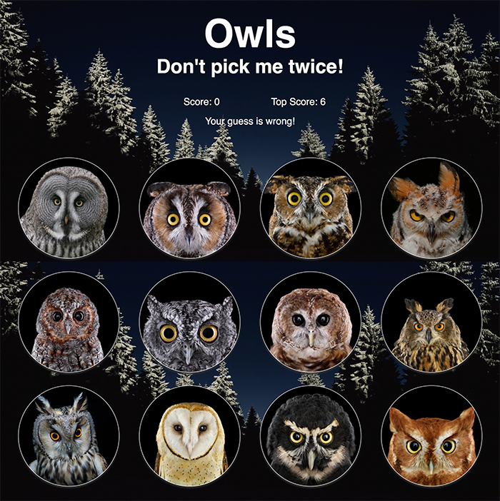

# Clicky Owls

### Overview

In this project, I built a memory testing game with React. I learned how to break an application's UI into components, manage component state, and respond to user events.

### Technologies

* React.js
* JSX
* ES6
* Create React App
* NPM & Yarn

### Deployed Link

https://zcdev.github.io/clicky-owls/

